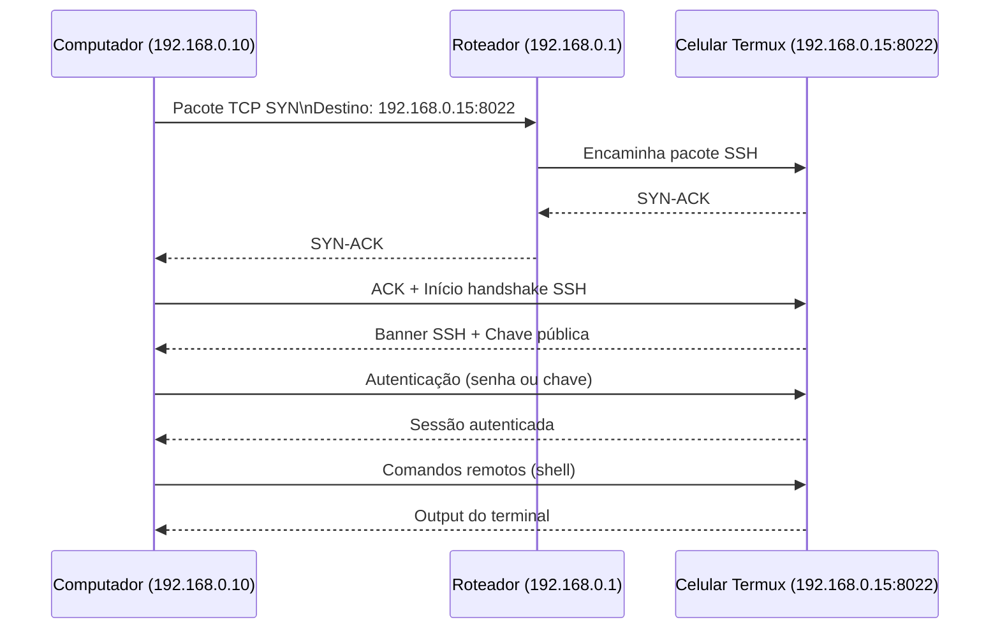

# Creating a portable homelab in a androind phone

#### Install
- [termux](https://termux.dev/en/)
- [localsend](https://localsend.org/pt-BR/download) Optional (if you don't plan to configure ssh, or just share the text files)

Customize para o que você precisar `openssh`, `python`, `nodejs`, `git`:

```bash
pkg update
pkg install openssh python nodejs git
pip install flask
```

### Como funciona a conexão (padrão de conexão ssh):



## Configurando o ssh

Crie uma senha para acessar via `passwd`

```bash
passwd
whoami
```


PS: para conectar com os exemplos preste atenção nas portar, python e node rodam na `:8000` o ssh `:8022`

## Para conectar via `ssh`:

`u0_aXXX` = usuário do whoami (geralmente tem as iniciais `u0_a` seguida de 3 numeros, mas pode mudar para cada fabricante)
`192.168.0.15` = ipmostrado no termux

```bash
ssh -p 8022 u0_aXXX@192.168.0.15
```

Ou

```bash
ssh -p 8022 192.168.0.15
```

## To run the example projects:

As a normal project of each platform 

In PC (or other thing) running the client.

> python pc.py

```nodejs
npm install
npm start
```

```nodejs
python worker.py
```

