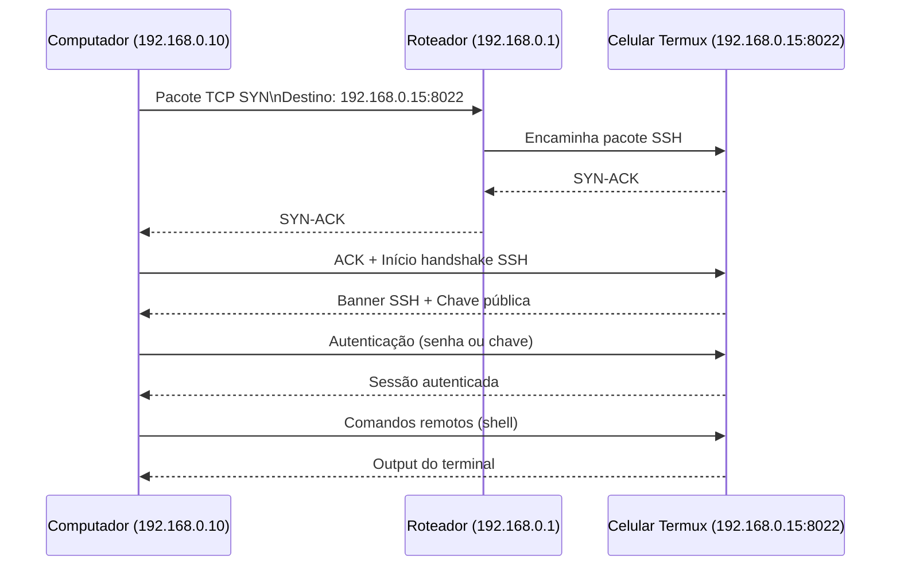

# Portable Homelab Tutorial / Tutorial Homelab Portátil

* [English Version](#english-version)
* [Versão em Português](#versão-em-português)

## English Version

### Creating a Portable Homelab on an Android Phone

#### Installation

* **[Termux](https://termux.dev/en/)**: The terminal emulator and Linux environment.
* **[LocalSend](https://www.google.com/search?q=https://localsend.org/en/download)** (Optional): Useful if you don't want to configure SSH or just need to share text files quickly.

Customize your environment with the tools you need (`openssh`, `python`, `nodejs`, `git`):

```bash
pkg update
pkg install openssh python nodejs git
pip install flask

```

### How the connection works (SSH standard):





### Configuring SSH

Create a password to allow access via `passwd`:

```bash
passwd
whoami

```

> **Note on Ports:** Pay attention to the port numbers. Python and Node typically run on `:8000`, while Termux's SSH service runs on `:8022`.

### To connect via SSH:

1. **Start the SSH service (on your phone):**
```bash
sshd -p 8022

```


2. **Identify your credentials:**
* `u0_aXXX`: The user returned by the `whoami` command.
* `192.168.0.15`: The IP address of your phone on the local network.


3. **Connect from your PC (or another client):**
```bash
ssh -p 8022 u0_aXXX@192.168.0.15

```


### Running the example projects:

Run them as standard projects for each platform. On the client side (PC or other device):

**Python:**

```bash
python worker.py

```

**Node.js:**

```bash
npm install
npm start

```

### Testing the requests:

```bash
curl -X POST http://PHONE_IP:8000/compute \
     -H "Content-Type: application/json" \
     -d '{"start": 0, "end": 100000}'

```

---

## Versão em Português

### Criando um Homelab Portátil em um Celular Android

#### Instalação

* **[Termux](https://termux.dev/en/)**: Emulador de terminal e ambiente Linux.
* **[LocalSend](https://localsend.org/pt-BR/download)** (Opcional): Útil se você não planeja configurar SSH ou apenas quer compartilhar arquivos de texto.

Personalize para o que você precisar (`openssh`, `python`, `nodejs`, `git`):

```bash
pkg update
pkg install openssh python nodejs git
pip install flask

```

### Como funciona a conexão (padrão de conexão SSH):


### Configurando o SSH

Crie uma senha para permitir o acesso remoto:

```bash
passwd
whoami

```

> **Nota sobre Portas:** Fique atento às portas. Projetos Python e Node geralmente rodam na `:8000`, enquanto o SSH do Termux roda na `:8022`.

### Para conectar via SSH:

1. **Iniciando o serviço SSH (no celular):**
```bash
sshd -p 8022

```


2. **Identifique os dados:**
* `u0_aXXX`: Usuário retornado pelo comando `whoami`.
* `192.168.0.15`: IP mostrado no Termux/Configurações de rede.


3. **Conectando no celular (via PC ou outro cliente):**
```bash
ssh -p 8022 u0_aXXX@192.168.0.15

```


### Para rodar os projetos de exemplo:

Execute como um projeto normal de cada plataforma. No computador rodando o cliente:

**Python:**

```bash
python worker.py

```

**Node.js:**

```bash
npm install
npm start

```

### Para testar as requisições:

```bash
curl -X POST http://IP_DO_CELULAR:8000/compute \
     -H "Content-Type: application/json" \
     -d '{"start": 0, "end": 100000}'

```
